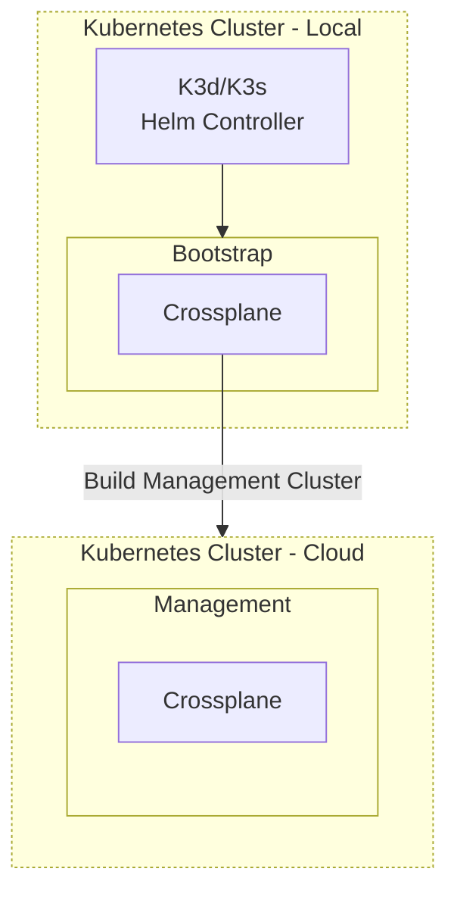

<p align="center">
  <a href="https://devopshive.net/" style="display: block; padding: 1em 0;">
    
  </a>
</p>

<h1 align="center">Crossplane Bootstrapper</h1>
<p align="center"><b>Fix the cloud-native control plane paradox!<br/>Start the initial setup of Crossplane from a local Kubernetes cluster
</b></p>

> [!IMPORTANT]
> The following instructions require K3d v5.7.0 or above.

> [!TIP]
> Checkout [KubeZero](https://github.com/DevOpsHiveHQ/kubezero) if you want an easy way to build a production-ready out-of-the-box Kubernetes platform IaC with GitOps designed for multi-environment Cloud Native setup.

## Why?

[Crossplane is awesome](https://github.com/DevOpsHiveHQ/awesome-crossplane)! It is an open-source Kubernetes add-on that extends Kubernetes to manage and provision cloud infrastructure resources using Kubernetes-style configurations. Arguably I'd say it's the best cloud-native way to do IaC and GitOps for infrastructure!

However, it has one tiny challenge given it only works on Kubernetes ... that it needs a working Kubernetes cluster! That means it needs some manual work at the beginning to start the automation.

Here comes Crossplane Bootstrapper which utilizes [K3d](https://github.com/k3d-io/k3d) capabilities to automate that bootstrapping step.

## What?

Using Helm Controller in K3d/K3s you can set up Crossplane automatically in IaC style via a local cluster with minimal manual ad-hoc work which will build your main management cluster on the cloud.

Here is an overview of the flow:



## How?

By just running one command, you will have a local cluster with an up-and-running Crossplane which will build your cloud management cluster. You can customize the bootstrapped resources.

1. Prerequisites:
- [K3d](https://k3d.io/) CLI.
- Clone this repo (Crossplane Bootstrapper).
- Edit the config based on your needs [manifest-crossplane-bootstrapper.yaml](manifest-crossplane-bootstrapper.yaml)

2. Run:

```shell
k3d cluster create --config k3d-crossplane-bootstrapper.yaml
```

3. Ensure that everything works as expected:

```shell
kubectl get pod -n crossplane-system
```

4. You can customize the bootstrapping process as you like using [Crossplane Helm values](https://artifacthub.io/packages/helm/crossplane/crossplane/) or any extra Kubernetes objects you need (for example, you will need to deploy the [ProviderConfig](https://docs.crossplane.io/latest/concepts/providers/#provider-configuration)).

## License

This project is open-source by [DevOps Hive](https://devopshive.net/) and licensed under Apache License 2.0. For more details, please review [LICENSE](LICENSE).
